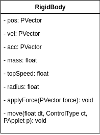
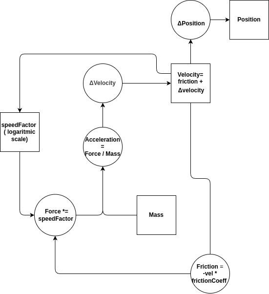

## Overview

This game was the final project for the course Modelation and Simulation of Natural Systems. Throughout the course I've learned many topics such as Physics Simulation, Particle Systems, Autonomous Agents, Cellular Automata and Fractals. The systems I ended up implementing into my game were:

- Physics Simulation
- Autonomous agents and Boids
- Particle System
- Procedural Generation: Cellular Automata

You'll be able to learn how I developed these systems in much more detail in the next section!

## Key Systems

:::features
- title: Physics Simulation
  description: RigidBody and Collision System
- title: Boids
  description: Autonomous agent that is the brain behind the enemies of this game, implementing seek and wander behaviours
- title: Particle System
  description: A simple particle system used for the exhaust of the ship
- title: Cellular Automata
  description: Procedural technique used to make a cave-like map
:::

## Physics Simulation

### The Body

Before we can have physics in a game we need a way to represent our "things" or our "objects" like the player, enemy, etc, in the simulated physical world of our game. With that in mind I implemented a RigidBody that will represent all the entities that move in my game: the player, the enemy and even projectiles.

:::collapsible RigidBody Diagram
A rigid body means that it will not be possible to deform the body, in other words, the distance between any points of a given body stays the same no matter what forces are applied to it. However, the body can move throughout space when forces are applied to it. In this game both friction and velocities are simulated by the rigidBody. For this to be possible we need the following vectors:

- Position Vector with x and y coordinates to represent its position in space
- 2d Velocity Vector
- 2d Acceleration Vector
- A method to apply force to the body once
- A method to simulate all forces applied to the body



Now that we have a way to represent our body in the virtual world we need a way to move it. In the next diagram you can see how the movement was planned out:


:::

:::collapsible RigidBody Code
### The RigidBody

The RigidBody class has 3 types of movement that each child can use:

- **Position** - the Vector Position is directly accessed and altered, equivalent to teleportation
- **Velocity** - generic case where the body has velocity and acceleration
- **Force** - where each instance of a RigidBody can override the main way of moving

The following code represents the types of movement mentioned in the class RigidBody:

```java
public void move(float dt, ControlType ct, PApplet p) {
    switch (ct) {
        case POSITION:
            break; //not useful for this game

        case VELOCITY:
            vel.add(acc.mult(dt));
            pos.add(PVector.mult(vel, dt));
            break;

        case FORCE:
            force(dt, p); // each child of RigidBody has its own way of moving
            break;
    }
}

protected abstract void force(float dt, PApplet p);
```
:::

## Challenges

The first problem was that I had to implement all these systems from scratch in a month, which can be overwhelming. On top of that we were required to use the Processing library with Java, which is not a tool designed to make games. However, despite these hurdles I successfully implemented the systems mentioned above.

## Reflection

This project was useful to learn how physics can be implemented in games. In particular it helped me have a better grasp of the implementation of a RigidBody, which is common in many engines. It also helped me understand different systems like boids, cellular automata and particle systems.

- I feel more comfortable using CA for map generation
- I have learned to implement all the systems used
- I have learned how particle systems and other systems work
- Overall this project was an incredible learning opportunity!
